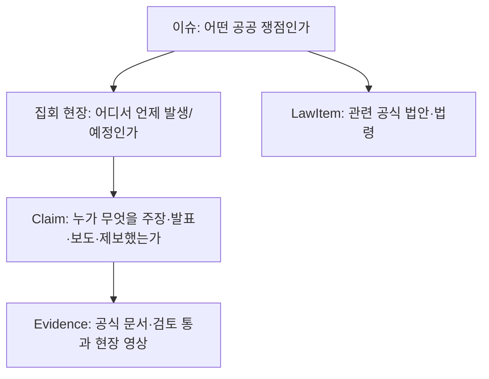
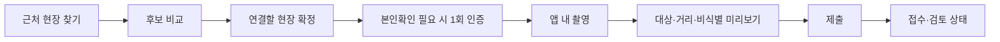

# 무슨일 라이브 서비스 감사 및 S+ 개선 방향

작성 시각: 2026-07-19 16:45 KST  
대상: [https://musunil.com](https://musunil.com) 실제 배포 화면, 390px 모바일 및 데스크톱 화면  
판정: **출시 전 개선 필요. 현재 상태는 S+가 아니며, 공개 베타로도 판단하지 않는다.**

## Final Goal

`musunil.com`에서 누구나 로그인 없이 주요 집회·시위 이슈를 이해하고, 같은 집회 현장을 홈·지도·영상·법안에서 일관되게 확인하며, 본인확인 후에는 안전한 현장 영상 제보까지 완료할 수 있는 상태를 만든다. 최종 판정은 실제 운영 도메인, API, 공식 원천, 보안 헤더, 모바일·데스크톱 화면 흐름의 검증 증거가 모두 통과한 경우에만 `S+`다.

합성 영상, mock 데이터, preview 자산은 로컬 또는 staging 검증에만 쓴다. production API, 정적 fallback, 공개 화면에는 시민 제보 또는 실제 공개 Evidence처럼 보이게 노출하지 않는다.

## Execution Board

이 문서는 상세 실행 상태의 유일한 기준이다. `docs/splus-master-tracker.md`와 `docs/splus-completion-audit.md`는 이 보드의 출시 게이트 요약만 유지한다.

| Goal | 상태 | 완료 기준 |
| --- | --- | --- |
| G1. 공통 집회 현장 UX 계약과 모듈형 정적 웹 기반 | **Guard** | `OccurrenceDigest` API 계약, 단일 선택 상태, recursive manifest, API/Web/visual smoke가 통과했다. |
| G2. 이슈 우선 홈과 현장 파일 | **Guard** | 홈은 이슈 우선으로 유지되고, 상세 첫 화면의 `전국 집회 현장`에서 장소·시간·상태·규모 상태·근거·관련 법안으로 이동한다. |
| G3. 지도와 집회 현장 상세 동일성 | **Guard** | 핀·영역·검색·홈 카드가 공유 선택 상태를 쓰고, 탐색 진입의 비동기 이슈 렌더가 현장 시트를 덮지 않는다. |
| G4. 공정한 릴스형 증거 영상 탐색 | **Guard** | 공개·비식별·Proof-of-Presence·기기무결성 조건을 통과한 영상만 이슈·현장·지역 버킷으로 순환하고, 영상·현장·상세가 같은 OccurrenceDigest를 유지한다. production 공개 영상이 없으면 빈 상태만 표시한다. |
| G5. 공식 법안 피드와 이슈 연결 | **Guard** | 국회 의안의 공식 발의일과 현행 법령의 공포·시행일을 분리하고, `현장 관심`/`최근 발의` 정렬 및 이슈·집회 현장 교차 이동을 local에서 통과했다. 실제 원천 적재·live 검증은 G7에서 다시 수행한다. |
| G6. 현장 제보의 확신 가능한 완료 흐름 | **Guard** | 위치 기반 후보·대상 확정·본인확인·앱 내 촬영·미리보기·대상 변경·접수·새로고침 뒤 접수 상태를 local staging API와 브라우저에서 통과했다. 실제 PortOne/저장소/비식별/모바일 무결성 운영 리허설은 G7에서 수행한다. |
| G7. 실제 운영 연결과 공식 원천 복구 | **Active** | API DNS, Render, DB/Redis, 원천, 보안 헤더, service watch가 live로 통과한다. |
| G8. 라이브 S+ 종결 감사 | Pending | 모든 행이 `S+` 또는 `Guard`이고 external blocker가 0건이다. |

## Change Log

| 일시 | Goal | 사용자 문제 | 변경 | 검증 |
| --- | --- | --- | --- | --- |
| 2026-07-19 | G1 | 홈·지도·상세가 서로 다른 선택 대상을 가리킬 수 있음 | `IssueOverview`/`OccurrenceDigest` additive API, `selectedOccurrenceId` 모듈 상태, ES module API/contract foundation, recursive static manifest를 도입 | `@musunil/api test`, `check:web-manifest`, `check:web-smoke`, `check:web-flow`, `check:ux-surface`, `check:visual-surface`, `check:web-render-build-command` 통과 |
| 2026-07-19 | G2 | 이슈를 열어도 장소·시간별 집회 현장이 첫 답으로 나오지 않음 | 이슈 상세 첫 화면을 `전국 집회 현장` 목록으로 바꾸고, 현장 선택과 관련 공식 법안 이동을 같은 상세 흐름에 연결 | `check:web-smoke`, `check:web-flow`, `check:ux-surface`, 390/430/768/1440 `check:visual-surface` 통과 |
| 2026-07-19 | G3 | 지도 상단이 선택 핀과 다른 이슈를 가리킬 수 있음 | 지도 맥락 스트립을 공유 `selectedOccurrenceId`에서 읽어 현장명·지역·공개 위치·영상 상태를 표시하도록 변경 | `check:web-smoke`, `check:web-flow` 통과. MapLibre 실제 interaction capture는 진행 중 |
| 2026-07-19 | G3 | 이슈 선택 뒤 탐색으로 이동할 때 비동기 이슈 상세가 현장 시트를 덮을 수 있음 | 탐색/지도 경로는 항상 선택 `OccurrenceDigest`의 상세를 렌더하도록 분기 | `check:web-smoke`, `check:web-flow`, 390/430/768/1440 `check:visual-surface` 통과 |
| 2026-07-19 | G4 | 영상 탭이 선택 이슈 한 건에 묶여 있고 적은 노출 현장을 발견할 수 없음 | `GET /reels`를 추가했다. 공개 Claim 중 비식별 완료·Proof-of-Presence 통과·기기무결성 통과·공개 clip/poster가 모두 있는 Evidence만 `EvidenceReel`로 파생하고, 이슈 → 현장·지역 버킷 → 영상 순서의 seed 기반 round-robin으로 반환한다. | API self-check의 10,000 seed 순환, 공개 payload 비밀 필드 검사, production seed `/reels` 빈 목록 통과 |
| 2026-07-19 | G4 | 전역 릴스의 재생 영상과 데스크톱 맥락 패널이 다른 현장을 가리킬 수 있음 | 재생 중 릴스의 `OccurrenceDigest`를 공유 선택 상태와 우측 패널에 동기화하고, `현장` 액션은 같은 현장 ID의 지도·상세로 이동하게 했다. 홈 카드에서는 대형 영상 미리보기를 제거해 이슈 스캔 밀도를 회복했다. | `check:web-smoke`, `check:web-flow`, `check:ux-surface`, `check:visual-surface`, `check:reels-staging` 통과 |
| 2026-07-19 | G5 | `최근 발의`가 처리일·앱 갱신일을 뜻하거나 비공식 링크가 섞일 수 있음 | `LawItem.proposedDate`를 추가하고 국회 의안의 공식 발의일만 `최근 발의` 정렬에 사용했다. 수집기는 최대 10개 공식 페이지를 읽고 공식 국회·법제처 도메인만 원문 링크로 허용한다. | API/worker self-check, migration check, 법 원천 metadata 진단 통과 |
| 2026-07-19 | G5 | 법안 카드가 이슈 설명에서 끝나고 같은 집회 현장으로 내려가지 못함 | 법안 탭에 `현장 관심`/`최근 발의` 정렬을 추가하고, 상세의 연결 이슈와 연결 현장을 각각 동일한 이슈 파일과 `OccurrenceDigest` 지도·상세로 이동하게 했다. | `check:web-smoke`, `check:web-flow`, 390/430/768/1440 visual smoke 및 [Goal 5 visual evidence](/Users/mk/Documents/Musunil/docs/visual-evidence/goal5-laws-verified/visual-surface-evidence.json) 통과 |
| 2026-07-19 | G6 | 첫 제보자가 촬영 전 대상·연결 이슈를 확신하지 못하고, 접수 뒤에도 자신의 영상 연결 상태를 확인하기 어려움 | 제보 흐름을 위치 후보 → 대상 확정 → 본인확인 → 앱 내 촬영 → 미리보기 → 제출 → 접수로 고정했다. 미리보기는 `검토로 제출/다시 촬영/대상 바꾸기`만 남기고, 접수 카드에는 사람이 읽을 수 있는 접수·자료 번호, 연결 현장·이슈·접수 시각·공개 반경을 표시한다. | `check:report-flow`, `check:web-smoke`, `check:web-flow`, `check:ux-surface`, API self-check, `check:release` 통과 |
| 2026-07-19 | G6 | 법안 상세 요청이 늦게 끝나면 사용자가 고른 집회 현장 상세를 다시 법안으로 덮을 수 있음 | 모든 상세 렌더에 최신 선택 세대 번호를 적용해, 늦게 끝난 이슈·법안 요청이 선택된 `OccurrenceDigest` 화면을 덮지 못하게 했다. | 390/430/768/1440 local staging visual smoke에서 법안 → 동일 집회 현장 제목 일치 통과 |
| 2026-07-19 | G7 | 최신 정적 화면처럼 보이지만 운영 빌드·API·보안 상태를 증명할 수 없음 | live service watch와 운영 handoff를 갱신했다. 정적 manifest 16개 파일은 현재 로컬 해시와 일치하고 Web runtime config는 `https://api.musunil.com`을 가리킨다. 반면 build-info placeholder, Web 보안 헤더 누락, API DNS 미연결을 명시적 출시 blocker로 유지했다. | `service:watch -- --once --with-visual`, `launch:handoff`, `launch:apply -- --json` 실행. 외부 credential 없는 dry-run만 수행 |
| 2026-07-19 | G7 | API가 끊긴 live Web에서 법안의 정직한 빈 상태가 시각 smoke의 가짜 실패로 섞임 | live visual smoke는 `serviceSyncState`가 non-live이면 법안 카드가 없는 공식 빈 상태를 허용하되, 전체 live service state는 계속 실패로 보고한다. | `check:visual-surface:production-fallback` 및 `ci-visual-surface-smoke --base-url https://musunil.com` 통과. service watch는 여전히 `delayed`를 출시 blocker로 처리 |

## Evidence Ledger

| Goal | 환경 | 증거 | 결과 | 남은 위험 |
| --- | --- | --- | --- | --- |
| G1 | local | `/home`·`/issues/:id`·`/occurrences/:id`·`/map` additive digest, module asset manifest, 390/430/768/1440 visual smoke | Guard | production API/DNS 미연결로 실제 live 데이터 교차 확인은 G7에서 수행 |
| G2 | local | 홈 이슈 카드 → 전국 집회 현장 → 현장 상세, 이슈 → 관련 공식 법안 흐름 | Guard | 실제 원천 API가 연결된 live 화면에서 5·10초 검증은 G7/G8에서 재실행 |
| G3 | local | 핀/영역/검색 → 선택 현장 상세, 지도 맥락 스트립과 상세의 대상 동기화 | Guard | 실제 production MapLibre interaction capture와 live API payload 비교는 G7/G8에서 재실행 |
| G4 | local + staging | `/reels` public serializer, 10,000 seed fairness simulation, production seed 0건, `check:reels-staging`에서 390/430/768/1440 영상 재생 surface와 `현장` → 동일 `selectedOccurrenceId`/지도·상세 제목 일치 | Guard | 실제 production 공개 Evidence가 생긴 뒤 production 화면에서 같은 검증을 G7/G8에 재실행 |
| G5 | local | `proposedDate` additive API, `/laws?sort=interest|proposed_desc`, trusted official URL guard, API/worker parser self-check, 390/430/768/1440 법안 정렬 및 법안 → 동일 집회 현장 이동 캡처 | Guard | 국회 API key 또는 법제처 OC 입력 후 실제 dry-run/post, live `/laws` 두 정렬과 공식 링크 재검증은 G7에서 수행 |
| G6 | local staging | 테스트 전용 PortOne verifier, mock GPS/camera recorder, 실제 write API, 세션 복원. [390px 미리보기](/Users/mk/Documents/Musunil/docs/visual-evidence/goal6-report-flow-verified/report_flow_mobile_390_preview.png), [390px 접수 결과](/Users/mk/Documents/Musunil/docs/visual-evidence/goal6-report-flow-verified/report_flow_mobile_390_receipt.png), [검증 JSON](/Users/mk/Documents/Musunil/docs/visual-evidence/goal6-report-flow-verified/visual-surface-evidence.json) | Guard | 테스트 영상과 test identity는 staging 한정이다. 실제 PortOne, 외부 암호화 저장소, 비식별, Play Integrity/App Attest 운영 smoke는 G7에서 재실행 |
| G7 | live | `service:watch -- --once --with-visual`: 정적 manifest 16개/2,458,357 bytes와 local hash 일치, Web config의 공개 필드 2개와 `https://api.musunil.com` 일치, 4 viewport 정직한 fallback surface | **Active / blocked** | `build-info.json`이 placeholder, `/`·`config.js`·`build-info.json` 보안 헤더 누락, `api.musunil.com` DNS 미연결, Render/Cloudflare token·API target·runtime Secret File·원천/PortOne/storage/비식별/무결성 credential 미입력 |

## Residual Risks

- `api.musunil.com` DNS와 Render API/DB/Redis가 아직 live로 연결되지 않았다.
- Render Static Site가 Blueprint와 분리된 수동 설정을 사용 중이다. Dashboard의 Build Command를 `corepack enable && pnpm install --frozen-lockfile && pnpm build:web-static:render`로 바꾸고, `render:web-settings`의 6개 헤더를 적용한 뒤 Clear build cache & deploy가 필요하다.
- `RENDER_API_TOKEN` 또는 Render에서 복사한 `MUSUNIL_RENDER_API_DNS_TARGET`, 그리고 `CLOUDFLARE_API_TOKEN` 없이는 api custom domain, DNS, Cloudflare header rule을 자동 적용할 수 없다. 자동화는 이 값이 생기기 전까지 dry-run만 수행한다.
- 국회·법제처 원천 키, PortOne, storage, 비식별, 모바일 무결성 운영 credential은 Goal 7 전까지 실제 검증할 수 없다.
- G5의 운영 law feed는 실제 credential 없이 비어 있어야 하며, 현재 production fallback이 그 원칙을 지킨다. 실제 법안은 key/OC 입력과 ingest 성공 이후에만 표시할 수 있다.
- production에는 공개 통과 실제 현장 영상이 없으므로, Goal 4는 staging fixture 검증과 정직한 production 빈 상태를 분리해 Guard로 두었다. 실제 공개 Evidence가 생기면 G7/G8에서 재검증한다.
- G6의 GPS·카메라·PortOne test verifier는 local staging runner에서만 사용했다. production은 `MUSUNIL_IDENTITY_TEST_MODE`를 허용하지 않으며, 실제 운영 리허설 전에는 현장 제보 완료를 production S+ 증거로 취급하지 않는다.

## 1. 감사 범위와 실제 확인 결과

이 문서는 로컬 구현이나 이전 캡처가 아니라 2026-07-19에 실제로 접속한 `musunil.com`을 기준으로 작성했다. 읽기 전용으로 홈, 이슈 상세, 영상, 탐색 지도, 법안, 제보 진입 화면을 확인했다. 위치 권한, 카메라, 본인확인은 사용자의 실제 권한을 요청하지 않아 완료 흐름까지 실행하지 않았다.

| 항목 | 실제 관찰 | 판정 |
| --- | --- | --- |
| 정적 웹 | `https://musunil.com`은 200으로 응답하고, 정적 파일 해시는 로컬 `main`의 `7d0b6e59c7dc01fe04c162ffc6ee4b98f7752b11`과 일치 | 최신 정적 화면은 배포됨 |
| 빌드 식별 | `/build-info.json`이 `generated-at-build`, `1970-01-01`, `source: placeholder`를 반환 | 현재 커밋을 운영에서 증명할 수 없음 |
| API 연결 | Web `config.js`는 `https://api.musunil.com`을 가리키지만 해당 호스트는 DNS 해석 실패 | 실제 API/원천/인증/제보 운영 불가 |
| 홈 데이터 | `공개자료로 먼저 확인`, `일부 자료 확인 중` 배너와 4개의 fallback 이슈가 보임 | 실제 전국 원천 기반 피드 아님 |
| 이슈 상세 | 이슈 제목, 위치 수, 현장 수, 근거 수, 반론·정정 탭은 보임 | 현장 단위가 이슈의 하위 핵심 화면으로 드러나지 않음 |
| 영상 | 선택된 이슈 하나의 `공개 영상 대기` 카드만 보임 | 릴스 탐색과 균등 노출이 구현/검증되지 않음 |
| 탐색 지도 | 지도와 핀, 현장 캡션은 보이나 선택 이슈와 지도 현장 캡션이 동시에 다른 대상을 가리킬 수 있음 | 같은 현장 상세로 연결되는 계약이 불명확 |
| 법안 | `표시할 법령·의안이 없습니다`만 표시 | 실제 공식 법안 피드와 정렬 기능 없음 |
| 제보 | `근처 현장 찾기` 단일 행동은 보임 | 본인확인, 위치 후보, 촬영, 미리보기, 접수까지의 실서비스 증거 없음 |

엄격한 배포 검증도 같은 결론이다.

```text
MUSUNIL_WEB_BASE_URL=https://musunil.com \
MUSUNIL_EXPECTED_API_BASE_URL=https://api.musunil.com \
MUSUNIL_EXPECTED_COMMIT_SHA=7d0b6e59c7dc01fe04c162ffc6ee4b98f7752b11 \
corepack pnpm check:web-deploy

실패: build-info placeholder was deployed while expected commit ... was required
```

정적 파일 자체는 최신이지만, 운영 앱으로는 아직 연결되지 않았다는 뜻이다. 이 상태에서 fallback을 실제 전국 집회 데이터처럼 보이게 하거나 법안/영상 기능이 완성됐다고 표기해서는 안 된다.

## 2. 제품 계층: 사용자 용어와 데이터 원칙

사용자가 말하는 `이벤트`는 화면에서 이해하기 쉬운 **집회 현장**이라는 용어로 제공한다. 내부 모델에 `Event` 단일 진실 객체를 만들지 않는다.



- **이슈**는 첫 화면의 탐색 단위다. 예: `정보통신망법 개정`, `대통령 탄핵 관련 쟁점`.
- **집회 현장**은 장소·시간이 분리된 `Occurrence` 또는 `ContinuousPresence`다. 사용자가 기대하는 “이벤트 카드”는 이 단위다.
- **Claim/Evidence**는 현장을 확정하는 사실이 아니라, 출처와 근거가 분리된 자료다.
- **LawItem**은 공식 의안/법령 참조다. Claim이나 Event가 아니며 `IssueLawLink`로 이슈에 연결한다.

이 계층이 화면 전체에서 동일해야 한다. 홈의 이슈, 지도 핀, 릴스, 법안 상세가 서로 다른 임시 카드 구조를 쓰면 사용자는 같은 현장을 보고 있다는 확신을 얻지 못한다.

## 3. 현재 UX의 핵심 문제

### 3.1 홈이 “주요 쟁점”보다 관리용 대시보드처럼 보인다

현재 홈은 빠른 이슈 링, 긴 이슈 카드, 지도 패널을 한 화면에서 동시에 강하게 보여 준다. 카드마다 `위치 / 근거 / 현장 n건 / 공개 위치 n곳 / 반론·정정`이 반복되어, 첫 방문자가 제목을 읽기 전에 숫자와 상태를 해석해야 한다. `정보통신망법 개정 반대 집회`와 `정보통신망법 개정 관련 집회`처럼 가까운 이름도 별개의 최상위 카드로 보여 주제 경계가 흐려진다.

사용자가 홈에서 먼저 알아야 하는 것은 `오늘 무엇이 주요 쟁점인가`다. 지금처럼 “확인해야 할 데이터 속성”이 먼저 보이면 공공 조회 서비스가 아니라 내부 운영 대시보드로 읽힌다.

### 3.2 이슈를 열어도 집회 현장 목록이 첫 번째 답이 아니다

상세 바텀시트는 개요, 근거, 영상, 흐름, 반론 탭을 제공하지만, 이슈 아래의 **장소·시간별 집회 현장**이 첫 화면의 중심 객체가 아니다. `현장 2건`은 보이지만 사용자는 어느 현장인지, 규모가 어떤 근거에서 나온 것인지, 어느 현장의 영상을 볼 수 있는지를 바로 확인할 수 없다.

### 3.3 영상 탭은 릴스 목적을 충족하지 못한다

실제 라이브 영상 탭은 선택 이슈 하나의 대기 카드만 표시한다. 공개 가능한 영상이 없다는 상태 자체는 정직하지만, 다음이 없다.

- 서로 다른 이슈·지역·현장을 섞어 발견하게 하는 탐색 풀
- 적은 노출의 현장도 보장하는 균등 노출 규칙
- 세로 스와이프 단위의 영상, 현장, 이슈, 근거, 다른 주장 연결
- “이 영상이 어느 현장의 어떤 Claim인가”를 즉시 확인하는 맥락

### 3.4 지도에서 “어떤 핀을 눌렀는가”와 상세 대상이 분리될 수 있다

탐색 화면은 지도 중심이라는 요구에 가까워졌지만, 상단에는 선택 이슈가 남아 있고 지도 캡션은 `대구 7월 9일 집회 공개 일정`처럼 별도 현장을 표시한다. 사용자는 핀을 눌렀을 때 홈에서 보던 바로 그 현장 카드가 열릴 것이라 예상한다. 현재는 선택 이슈 요약, 지도 캡션, 지역·이슈 탐색 칩이 병렬로 존재해 대상 일치가 약하다.

### 3.5 법안 탭은 현재 제품 약속을 수행하지 못한다

실제 화면에는 공식 법안이 한 건도 없고, `현장 관심`과 `최근 발의` 정렬도 없다. 이 탭은 “이슈가 왜 공적 쟁점인지”를 설명하는 중요한 축인데, 빈 상태라면 홈·상세의 관련 법안 연결도 실제로 검증할 수 없다.

### 3.6 제보 진입은 방향은 맞지만 끝까지 검증되지 않았다

`근처 현장 찾기`를 첫 행동으로 둔 것은 적절하다. 그러나 라이브 API와 본인확인이 연결되지 않았으므로, 사용자가 다음을 확신할 수 있는지 아직 증명되지 않았다.

- 내 영상이 어느 집회 현장 Claim에 붙는가
- 가장 가까운 후보와 거리가 무엇인가
- 잘못 선택했을 때 제출 전 바꿀 수 있는가
- 공개 전 비식별 검토와 접수 상태가 어떻게 보이는가

## 4. 탭별 S+ 목표와 개선 항목

아래는 화면 위치를 미리 고정한 정답이 아니라, 실제 사용자 흐름으로 검증해야 하는 **제품 계약**이다. 시각 구성은 프로토타입 비교를 통해 선택하되, 이 계약은 바꾸지 않는다.

| 탭 | 사용자가 즉시 얻어야 하는 답 | 현재 판정 | 출시 전 반드시 갖출 계약 |
| --- | --- | --- | --- |
| 홈 | 지금 중요한 공공 쟁점은 무엇인가 | C- | 이슈를 우선순위대로 보여 주고, 한 탭으로 현장·근거·영상·법안에 도달 |
| 영상 | 내가 몰랐던 현장도 포함해 무엇이 실제로 촬영·검토됐는가 | D | 검토 통과 영상만 세로 탐색, 이슈·현장·근거를 항상 함께 표시, 노출 편향 방지 |
| 탐색 | 어디에서 어떤 집회 현장이 확인됐는가 | C- | 지도 핀/영역과 동일한 현장 상세가 열리고, 선택 상태가 홈과 동기화 |
| 법안 | 어떤 공식 법안이 왜 이 이슈와 연결되는가 | F | 실제 공식 의안/법령, `현장 관심` 및 `최근 발의` 정렬, 공식 링크 |
| 제보 | 내 영상이 어느 현장에 안전하게 접수되는가 | C+ | 위치 후보 확정 후에만 촬영, 미리보기, 대상 재확인, 접수 추적 |

### 4.1 홈: 이슈 우선, 현장으로 자연스럽게 내려가기

**첫 5초 목표**: 화면을 열면 대표 이슈 제목 3~6개와 각각의 `현장 확인` 상태가 보인다. “지역 확인 중” 같은 내부 확인 문구가 제목보다 먼저 읽히면 실패다.

주요 이슈의 순서는 소셜 참여율이나 조회수로 정하지 않는다. 아래의 파생 신호를 사용하고, 각 신호의 의미를 사용자 문구로는 `전국 확산`, `현장 확인`, `새 공식 일정`, `다른 주장 있음` 정도로만 설명한다.

- 공개 가능 Proof-of-Presence Evidence가 붙은 서로 다른 현장 수
- 서로 다른 시·군·구 또는 권역 수
- 최근 공식 일정과 최근 검토 통과 Claim
- 출처가 다른 Claim 간 쟁점/정정 존재
- 최신성 및 이슈에 연결된 공식 법안의 심사·발의 일정

후원, 좋아요, 조회수, 제보 원문량, 신고 수, 단일 출처의 주장량은 순위 신호에 넣지 않는다. 인원 규모도 독립 근거가 충분할 때만 범위로 표시하고, 그렇지 않으면 `인원 확인 중`으로 남긴다.

이슈 카드는 제목, 상태 한 줄, 가장 중요한 현장 수/권역 수, 대표 장소·시각, 근거 상태만 갖는다. 지금의 2행 KPI와 여러 CTA를 카드에서 제거한다. 카드 전체를 탭하면 `이슈 파일`이 열리고, 그 안의 첫 내용은 아래 **집회 현장 목록**이다.

### 4.2 이슈 파일과 집회 현장 카드: 홈과 지도의 공통 객체

이슈 파일의 첫 섹션은 `전국 현장`이다. 각 현장 카드에는 다음만 일관되게 표시한다.

- 장소와 시간: `서울 광화문 · 7월 20일 14:00`, 시간이 불명확하면 `시간 확인 중`
- 상태: 예정, 진행 확인, 종료 후 기록, 장기 현장 중 하나
- 규모: 근거가 충분한 경우에만 범위와 산정 상태, 아니면 `인원 확인 중`
- 핵심 쟁점: 이 현장에서 확인되는 한 줄 요약
- 근거: 공식 자료 수, 공개 가능 영상 수, 다른 주장 여부를 분리

현장 카드를 열면 `개요 / 근거 / 영상 / 흐름 / 다른 주장`을 제공한다. 이 탭 구성은 현장 자체에만 적용한다. 이슈의 전체 쟁점을 볼 때와 특정 장소·시간의 자료를 볼 때를 섞지 않는다.

홈 이슈 카드, 지도 핀, 지도 영역, 릴스의 `현장 보기`는 모두 같은 `OccurrenceDigest`를 연다. 이 일관성이 사용자에게 “방금 보던 그 집회 현장”이라는 확신을 준다.

### 4.3 영상: 무작위성은 공정한 발견 장치여야 한다

영상 탭은 공개 가능한 현장 영상 Claim이 있을 때에만 릴스형 탐색을 연다. 영상이 없다면 릴스를 흉내 내는 빈 카드 대신, 공개 가능한 현장 영상이 없다는 정직한 빈 상태와 다른 이슈/현장으로 돌아갈 수 있는 경로만 보여 준다.

공개 가능한 영상은 세로 스와이프 한 장면씩 표시한다. 화면에 영상만 두지 말고, 첫 화면에서 이슈명, 집회 현장, 공개 위치 범위, 촬영 시각 범위, 근거 상태를 읽을 수 있어야 한다. 액션은 `현장`, `근거`, `이슈`, `다른 주장`만 제공한다. 좋아요, 댓글, 공유 유도, 팔로우, 자유 평가를 넣지 않는다.

노출 알고리즘은 단순 인기순이나 완전 무작위가 아니다. 공개 가능한 영상 풀을 이슈·현장·지역·노출량 구간으로 나눈 뒤, 먼저 구간을 균등하게 고르고 그 안의 영상을 세션별 무작위로 선택한다.

- 같은 현장 영상이 연속으로 반복되지 않는다.
- 이미 많이 본 이슈만 계속 나오지 않는다.
- 공개 요건을 충족한 저노출 현장도 세션마다 발견될 가능성이 있다.
- 사용자별 정치 성향 추정, 시청 시간, 후원, 사회적 반응은 노출 가중치에 쓰지 않는다.
- 배포 전에는 시뮬레이션으로 지역·이슈·노출 구간별 편향을 측정하고 결과를 운영 로그로 남긴다.

### 4.4 탐색: 지도는 현장 발견과 확인의 중심

탐색 첫 화면은 지도다. 공개 지도에는 다음만 남긴다.

- 공개 원천에서 위치가 확인된 집회 현장의 자료 위치 핀
- 검토 통과한 Proof-of-Presence 영상 좌표에서 계산한 흐림 현장 인증 영역

핀이나 영역을 탭하면 전체 이슈 요약이 아닌 **해당 집회 현장 카드**가 즉시 열린다. 이 카드의 제목·시간·규모·근거·영상·관련 이슈·관련 법안은 홈에서 같은 현장을 열었을 때와 동일해야 한다. 지도 상단의 선택 이슈와 하단의 선택 현장이 다른 대상일 수 없도록 `selectedOccurrenceUnitId`를 단일 UI 상태로 둔다.

검색은 `지역, 이슈, 현장 검색`만 지원한다. 결과도 이슈와 현장을 구분해 표시한다. 교통선, 경로선, 인파 면, 추정 중심점, 정밀 GPS, 보고자 식별 정보는 공개 지도에 넣지 않는다.

### 4.5 법안: 실제 공식 데이터와 두 가지 정렬

법안 탭은 국회 의안정보와 법제처 법령정보에서 적재된 공식 항목만 표시한다. 개발용/예시 법안은 운영에 노출하지 않는다.

- `현장 관심`: 서로 다른 현장 수, 권역 확산, 검토 통과 Claim 수, 공식 일정 근접성으로 계산한다. 후원·조회·좋아요·신고·단일 제보량은 제외한다.
- `최근 발의`: 공식 발의일 내림차순으로 정렬한다.

카드에는 법안명, 의안 단계, 공식 발의/처리일, 연결 이슈 수, 연결 현장 수, 공식 원문 링크를 표시한다. 상세는 `개요 / 연결 이슈 / 공식 근거 / 변경 흐름`만 제공한다. 어떤 이슈와 연결되는지는 별도의 `IssueLawLink`로 설명 가능해야 하며, “법안이 곧 집회의 진실”처럼 보이면 안 된다.

### 4.6 제보: 첫 제보자도 대상과 결과를 확신해야 한다

제보의 한 화면 한 행동 원칙은 다음 순서다.



- GPS는 후보 정렬을 위해 브라우저 안에서 먼저 사용하고, raw 좌표는 제출 시 Proof-of-Presence 검증 경계에만 전달한다.
- 후보 카드에는 이슈명, 집회 현장명, 거리, 상태, 해당 영상이 연결될 Claim 대상을 표시한다.
- 대상 확정 전에는 카메라를 열지 않는다.
- 제출 전에는 대상 현장, 촬영 시각, 거리 판정, 공개 위치 반경, 비식별 검토 상태를 다시 보여 준다.
- 제출 후에는 `reportId`, `claimId`, 대상 이슈/현장, 접수 시각, 공개 위치 범위, 다음 단계가 있는 접수 카드를 보여 준다.
- 공개 읽기는 로그인 없이 유지하되, 제보/현장 판단/반론/정정/권리침해 신고/알림만 국내 본인확인 완료 세션을 요구한다. 별도의 회원가입 화면은 만들지 않는다.

## 5. 구현 우선순위와 Active Goal 순서

### Goal A. 운영 진실성 복구 (P0)

UI를 더 꾸미기 전에 실제 데이터 경로를 복구한다.

1. `api.musunil.com` DNS와 Render API 서비스를 연결하고 `/health`, `/ready`, `/home`, `/issues`, `/map`, `/laws`를 실제 공개 도메인에서 통과시킨다.
2. Render Static Site가 `corepack enable && pnpm install --frozen-lockfile && pnpm build:web-static:render`로 빌드되게 고정하고, 빌드 과정에서 실제 commit SHA와 build time을 `build-info.json`에 기록한다.
3. Render/Cloudflare에 CSP, Permissions-Policy, Referrer-Policy, X-Frame-Options, no-store 규칙을 적용한다.
4. 법안 원천 키를 Secret File/환경변수로 넣고, 공식 원천 ingest가 성공한 뒤에만 법안 피드를 켠다.
5. `serviceSyncState=live`와 source coverage가 확인되기 전에는 S+ 또는 정식 데이터라고 표기하지 않는다.

**완료 증거**: strict `check:web-deploy`, `cloudflare:check:strict`, API read smoke, source refresh smoke, 실제 `/laws` 공식 항목, live service watch가 모두 통과한다.

### Goal B. 공통 현장 단위 계약 (P0)

프런트엔드 파생 모델과 선택 상태를 하나로 정리한다.

- `IssueOverview`: 홈 이슈 카드와 주요 이슈 순위용
- `OccurrenceDigest`: 홈 이슈 파일, 지도, 검색 결과가 공통으로 쓰는 집회 현장 카드
- `EvidenceReel`: 공개 통과 영상 Claim의 릴스용 표현
- `LawInterestItem`: 공식 LawItem과 연결 이슈/현장 요약
- `ReportCandidate`: GPS 기반 제보 대상 후보

`OccurrenceDigest`의 동일 ID가 홈, 지도, 영상, 검색에서 유지되는지를 계약 테스트로 검증한다. Claim 중심 원칙, 출처/근거 강도/위험 수준의 분리, 정밀 위치 비공개는 이 단계의 회귀 금지 조건이다.

### Goal C. 정보구조 프로토타입 비교 (P1)

카드 배치나 탭 모양을 정답으로 고정하지 않는다. 모바일 390px과 데스크톱 1440px에서 다음 세 가지 가설을 같은 실제 데이터로 비교한다.

- 이슈 파일 우선: 홈에서 쟁점을 먼저 읽고 현장으로 내려감
- 지도 우선: 탐색에서 현장을 먼저 찾고 이슈로 올라감
- 조회 우선: 검색/필터에서 특정 이슈·현장을 바로 찾음

다만 제품의 기본 진입은 현재 사용 목적상 `이슈 파일 우선`이 유력하다. 실제 5초/10초/20초 테스트에서 다른 안이 더 낫다면 그 안을 선택한다. 테스트 전에는 “하단 탭 5개가 정답”이라고 선언하지 않는다.

### Goal D. 홈과 이슈 파일 재구성 (P1)

홈을 주요 이슈 목록 하나로 정리하고, 이슈 파일의 첫 화면을 전국 집회 현장 목록으로 바꾼다. 카드 안 KPI 그리드, 반복 상태칩, 지도와 동등하게 경쟁하는 미니 패널을 제거한다. 이슈에서 관련 법안과 대표 영상으로 가는 길은 유지하되, 현장 목록보다 앞에 두지 않는다.

### Goal E. 지도와 현장 상세 통합 (P1)

탐색 지도는 집회 현장 핀/인증 영역과 공통 현장 시트만 사용한다. 핀·영역·검색 결과·홈 현장 카드 중 무엇을 눌러도 같은 상세가 열리는지 상호작용 테스트를 추가한다. 현재처럼 이슈 맥락과 지도 캡션이 다른 대상을 지시하는 상태는 실패다.

### Goal F. 증거 영상 발견성 구현 (P1)

실제 공개 가능 영상이 충분한 환경에서 릴스형 스와이프와 공정 노출 알고리즘을 구현한다. 대기 카드로는 릴스 완성 판정을 하지 않는다. 영상 제출부터 검토 통과, 공개, 이슈·현장 연결, 반론·정정 병기까지의 실제 데이터 흐름을 검증한다.

### Goal G. 공식 법안과 제보 완성 (P1)

법안 두 정렬과 공식 원문 연결, 이슈/현장 교차 이동을 완성한다. 제보는 위치 후보, 1회 본인확인, 앱 내 촬영, 미리보기, 접수 카드까지 실제 API/스토리지/비식별 처리로 검증한다.

### Goal H. 상업용 사용성/배포 최종 판정 (P0)

다음 기준을 통과한 화면과 라이브 응답만 S+ 후보로 본다.

- 5초: “이 서비스는 전국 집회·시위의 어떤 쟁점을 보여 주는가”와 주요 이슈를 답할 수 있다.
- 10초: 한 이슈 안에서 어느 장소·시간의 집회 현장이 있는지, 규모가 확인됐는지 답할 수 있다.
- 20초: 해당 현장의 근거, 공개 영상, 다른 주장, 지도, 관련 법안으로 갈 위치를 알 수 있다.
- 홈 이슈 → 집회 현장 → 근거 → 지도 또는 영상 → 관련 법안이 5회 이내의 예측 가능한 조작으로 이어진다.
- 390px, 430px, 768px, 1440px에서 제목 잘림, 카드/버튼 겹침, 지도 선택 불일치, 빈 영상 릴스 위장, 내부 enum 노출이 없다.
- `좋아요`, `댓글`, `찬반`, `추천`, `비추천`, `팔로우`, 사용자 원문, 정밀 GPS, private media path가 공개 화면/API에 없다.

## 6. 출시 전 검증 시나리오

### 시나리오 1: 주요 쟁점에서 실제 현장까지

1. 홈에서 `정보통신망법 개정` 이슈를 연다.
2. 전국 현장 중 `서울 광화문 · 7월 20일` 현장을 고른다.
3. 규모가 범위인지 확인 중인지, 어떤 공식 자료/영상/다른 주장이 있는지 본다.
4. 대표 영상을 열고, 같은 현장 상세와 지도 위치 범위로 돌아간다.
5. 관련 법안을 열어 공식 원문으로 이동한다.

모든 대상 ID가 이슈 → 현장 → Claim/Evidence → LawItem 관계에서 일치해야 한다.

### 시나리오 2: 잘 알려지지 않은 현장 영상 발견

1. 영상 탭을 연다.
2. 세로 스와이프로 서로 다른 이슈·지역의 공개 통과 영상을 본다.
3. 노출이 적은 현장도 일정 확률로 등장하는지 집계한다.
4. 영상의 `현장`을 눌러 장소·시간·근거가 일치하는 현장 시트가 열리는지 확인한다.

### 시나리오 3: 지도에서 시작

1. 탐색 지도에서 핀 또는 인증 영역을 누른다.
2. 홈에서 보던 것과 같은 현장 제목, 시간, 근거 상태, 영상 수가 보이는지 확인한다.
3. 이슈를 열면 해당 현장이 그 이슈의 전국 현장 목록에서 선택된 상태로 보이는지 확인한다.

### 시나리오 4: 첫 현장 제보

1. 제보 탭에서 가까운 현장을 찾는다.
2. 후보 중 하나를 확정한 뒤에만 본인확인과 카메라가 열리는지 확인한다.
3. 촬영 후 대상·거리·공개 반경·비식별 검토를 확인하고 제출한다.
4. 접수 카드로 영상이 연결될 이슈와 집회 현장을 재확인한다.

## 7. 이번 감사의 결론

현재 라이브는 “최신 정적 UI를 보여 주는 fallback 데모” 단계다. 홈의 이슈, 지도, 제보 진입에는 올바른 방향의 요소가 있지만, 사용자가 요청한 핵심 경험인 **주요 쟁점 → 장소·시간별 집회 현장 → 검증 가능한 영상/근거 → 지도/법안 연결**이 하나의 일관된 흐름으로 작동하지 않는다.

가장 먼저 해결할 일은 디자인 장식이 아니라 API DNS·빌드 식별·공식 법안 원천을 포함한 운영 진실성이다. 그 다음에는 이슈와 집회 현장을 분리하고, 홈·지도·영상이 같은 현장 상세를 열게 만드는 공통 계약을 구현한다. 이 두 전제가 충족된 뒤에만 릴스형 발견성, 법안 정렬, 제보 완료 흐름을 실제 데이터로 검증할 수 있다.

이 문서는 다음 구현 사이클의 기준선이다. 각 Goal은 라이브 증거와 사용성 시나리오가 통과하기 전까지 완료로 변경하지 않는다.
